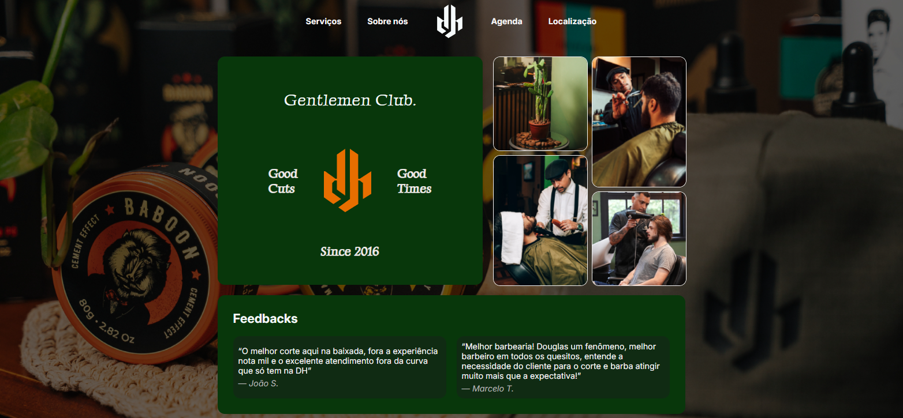

# 💈 Barbearia DH Gentlemen Club

Este repositório apresenta o redesign completo da interface web para a **Barbearia DH Gentlemen Club**. O projeto foi concebido com o objetivo de modernizar a presença digital da marca, elevar a experiência do usuário (UX) a um patamar altamente premium e garantir **100% de conformidade com as diretrizes de acessibilidade digital (A11y)**, atendendo de forma rigorosa aos padrões da **WCAG (Web Content Accessibility Guidelines)**.



---

## ♿ Painel de Acessibilidade (FAB) & Integração VLibras

Para garantir uma navegação democrática e inclusiva, o site conta com um ecossistema completo de recursos de acessibilidade injetados dinamicamente e persistidos automaticamente entre todas as páginas.

### 🌟 Recursos do Painel Flutuante (FAB)
* **Aumentar / Diminuir Fonte:** Ajuste dinâmico e proporcional do tamanho de todas as fontes do site em passos de 15% (mínimo de 70% e máximo de 145%) com redimensionamento responsivo.
* **Alto Contraste AAA:** Inversão completa da paleta cromática para um fundo preto absoluto (`#000000`), textos e bordas estruturais em amarelo vibrante (`#ffff00`) e links destacados em ciano (`#00ffff`), garantindo a aprovação máxima em testes de contraste visual de alta legibilidade.
* **Modo Claro (Premium Cozy Theme):** Uma inversão de design refinada e acolhedora para quem prefere leitura sob iluminação de contraste positivo. Substitui fundos escuros e pesados por uma base em tom linho suave (`#f5f2eb`), caixas de conteúdo e cartões em branco puro (`#ffffff`), textos em cinza-carvão de altíssima definição (`#1e1e1e`) e detalhes em cobre terroso (`#e26918`), adaptando de forma cirúrgica os logotipos e cartões das páginas.
* **Destacar Links:** Destaca instantaneamente todos os hiperlinks do site com um fundo amarelo brilhante, texto preto, sublinhado duplo e contornos fortes de foco.
* **Pausar Animações:** Interrompe imediatamente todas as transições de velocidade e animações cíclicas do CSS, garantindo navegação segura para pessoas com sensibilidade a movimentos (como labirintite e TDAH).
* **Resetar:** Remove todas as personalizações ativas e restaura instantaneamente a identidade estética original da barbearia.

### 🤟 Tradutor de Libras (VLibras)
Integramos de maneira assíncrona o widget oficial do **VLibras** (Tradutor de Língua Brasileira de Sinais). 
* **Disposição em Pilha:** O widget do VLibras está posicionado de forma perfeitamente simétrica e empilhado logo abaixo do nosso botão FAB no meio vertical direito da tela (a `30%` do topo), evitando qualquer conflito estético ou sobreposição de layout.

---

## 📐 Engenharia e Arquitetura de Software: Princípio DRY

Com o objetivo de evitar a repetição desnecessária de blocos de marcação HTML em todas as 6 páginas do site, o projeto foi estruturado sob o conceito **DRY (Don't Repeat Yourself)**:

* **Injeção Dinâmica Baseada em Componentes (`a11y.js`):** A estrutura HTML completa do FAB, do Menu de Opções e o próprio widget do VLibras são gerados e acoplados programaticamente no final do `<body>` de cada página durante o carregamento do DOM.
* **Estilização Reativa Global (`main.css`):** Todas as mutações e temas de acessibilidade reagem a classes aplicadas no elemento raiz (`<html>`), o que reduz drasticamente o tamanho dos estilos específicos e facilita a manutenção do código.
* **Persistência Unificada via State Management:** O estado atual de acessibilidade é mantido reativamente no `localStorage` do navegador através da chave `"a11y-state"`. Ao transitar entre páginas, o site lê esse estado e reaplica os estilos instantaneamente, eliminando qualquer tipo de piscada visual de contraste (*flash of unstyled content*).

---

## 🎛️ Usabilidade e Navegação Premium (WCAG/WAI-ARIA)

Projetamos o controle de navegação para simular o comportamento de uma aplicação nativa de desktop ou sistema operacional, garantindo total usabilidade por teclado:

* **Design Glassmorphism com Transição Suave:** O painel conta com desfoque de fundo inteligente (`backdrop-filter`) e abre através de um **efeito ultra suave de esmaecimento e deslizamento (*fade & slide*)** em `0.25s` via curva de velocidade cúbica (`cubic-bezier(0.16, 1, 0.3, 1)`).
* **Anel de Foco Cíclico Fechado:** Quando o menu está aberto, o foco do teclado (usando `Tab` ou `Shift + Tab`) circula continuamente entre o botão Gatilho e as opções de dentro do menu. Isso impede que o cursor do teclado se perca em outros elementos invisíveis da página.
* **Navegação por Setas (Arrow Keys UX):** Uma vez que o foco é posicionado no menu, o usuário pode navegar de forma rápida usando as teclas de **Setas Direcionais ($\uparrow$ / $\downarrow$)**, além de contar com atalhos rápidos com as teclas **Home** (ir para o primeiro item) e **End** (ir para o último item).
* **Foco Estabilizado:** Implementação de atrasos inteligentes de renderização (60ms) que impedem que o foco seja roubado pelo navegador durante cliques ou acionamentos rápidos pelo teclado.

---

## 🎨 Redesign Visual 2.0 & Estética Gentlemen Club

A interface passou por uma reformulação visual completa focada no conceito **Gentlemen Club moderno**:
* **Hero Banner Split 2 Colunas:** Exibição da marca e chamada principal no lado esquerdo com a foto em alta definição da placa oficial da barbearia (`logo-outdoor.jpg`) e pill badge de fachada no lado direito.
* **Métricas & Estatísticas (4 Colunas):** Barra horizontal de conquistas (`+8 Anos`, `+15.000 Cortes`, `4.9 ★`, `100% Exclusivo`).
* **Experiência Gentlemen Club:** Grid responsivo de 4 cards laterais destacando os diferenciais da barbearia (Visagismo, Bar & Lounge, Técnicas Clássicas, Produtos Keune/Baboon).
* **Galeria 3 Cards:** Fotografias em alta resolução sem distorções horizontais (*Corte Signature*, *Barboterapia* e *Espaço Gentlemen Club HD*).
* **Ícones Vetoriais SVG Inline:** Substituição integral dos emoticons por ícones vetoriais em SVG limpos, responsivos e estilizados por CSS (`currentColor` e `var(--color-accent)`).

---

## 📂 Estrutura do Projeto

A organização dos arquivos segue o padrão clássico e modular de páginas estáticas:

```text
BarbeariaDH/
├── assets/
│   ├── css/
│   │   ├── about.css       # Estilos específicos da página "Sobre Nós"
│   │   ├── location.css    # Estilos específicos da página "Localização"
│   │   ├── main.css        # Variáveis CSS, estilos globais e regras de Acessibilidade
│   │   ├── schedule.css    # Estilos específicos do formulário de Agendamento
│   │   └── services.css    # Estilos específicos da vitrine de Produtos/Serviços
│   ├── img/                # Assets gráficos e fotos otimizadas (ex: logo-outdoor.jpg, espelho-barbearia.jpg)
│   └── js/
│       ├── a11y.js         # Core de Acessibilidade, Loop de Foco e Injeção do VLibras
│       └── schedule.js     # Validação de formulário, máscara de telefone e horários dinâmicos
├── about.html              # Página "Sobre Nós"
├── index.html              # Página Inicial (Landing Page com Hero Split)
├── location.html           # Página de Localização e Mapa Interativo
├── schedule.html           # Formulário de Agendamento Inteligente com máscara de telefone
├── services.html           # Vitrine de Serviços e Produtos
├── success.html            # Confirmação de Agendamento Concluído
└── README.md               # Documentação Oficial (este arquivo)
```

---

## ♿ Validação de Acessibilidade e Qualidade de Código

O site passou por testes rigorosos de legibilidade e foi homologado com excelência nos principais validadores de acessibilidade digital do mercado:

1. **[WAVE Evaluation Tool (WebAIM)](https://wave.webaim.org/):** Alcançou o marco de **0 Erros de Acessibilidade, 0 Erros de Contraste e 100% de Elementos Estruturais Corretos** em todas as páginas analisadas.
2. **[AccessMonitor](https://accessmonitor.acessibilidade.gov.pt/):** Validação estrita focada na conformidade com o padrão WCAG 2.1, alcançando notas altíssimas de usabilidade e leitura inclusiva.
3. **Leitores de Tela:** Validado manualmente em ferramentas de leitura assistiva por voz (NVDA no desktop e TalkBack no mobile).

---

## 🚀 Como Executar o Projeto Localmente

Este é um projeto estático nativo em HTML, CSS e JavaScript, o que dispensa a necessidade de instalação de dependências ou servidores de compilação locais.

1. Clone este repositório ou baixe o arquivo comprimido (`.zip`).
2. Extraia os arquivos na pasta de sua escolha.
3. Dê duplo clique no arquivo `index.html` para executá-lo imediatamente em seu navegador de preferência.
4. *Opcional:* Para testar as alterações de código em tempo real com hot reload, abra a pasta no VS Code e execute a extensão **Live Server**.

---

## 🛠️ Ferramentas e Tecnologias Adotadas
* **Semântica Estrutural:** HTML5 semântico com marcação WAI-ARIA.
* **Layout & Estilização:** CSS3 Vanilla, Grid Layout, Flexbox e Custom CSS Variables.
* **Inteligência e Lógica:** JavaScript (JS Vanilla) modular e síncrono para manipulação do DOM e LocalStorage.
* **UI/UX Design:** [Figma](https://www.figma.com/) para concepção estética inicial.

---
*Projeto desenvolvido para fins acadêmicos.*
